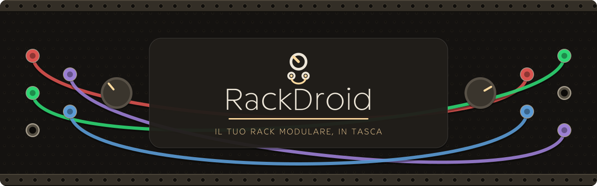
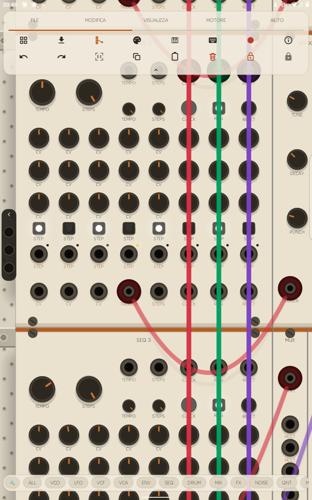
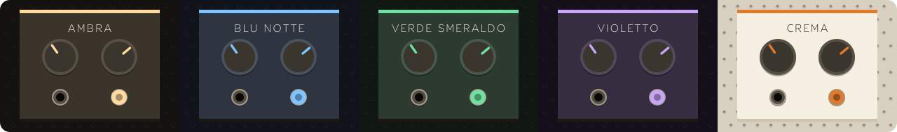

<div align="center">



<p>    </p>

<p><a href="README.md">English</a> · <b>Italiano</b> · 🌐 <a href="https://rackdroid.org">rackdroid.org</a> · non ufficiale, non affiliato a VCV</p>

Sintetizzatore modulare **touch-first** per Android: costruisci patch vere
trascinando cavi tra oscillatori, filtri, inviluppi e sequencer, esattamente
come su un rack hardware. Nessun compromesso: è il motore audio di
[VCV Rack 2](https://vcvrack.com), reso nativo per il telefono.




*Screenshot reali, da dispositivi veri, nessun mockup.*

</div>


- **È VCV Rack, non un clone.** Stesso motore, stessi 66 moduli di base,
  stesso formato patch `.vcv`: una patch fatta sul computer si apre sul
  telefono, e viceversa, e suona allo stesso modo.
- **Pensato per il tocco fin dall'inizio**, non una UI desktop rimpicciolita:
  cavi che si trascinano col dito, manopole che si tengono premute per
  digitare un valore, pizzico per lo zoom, palette moduli pensata per schermi
  piccoli, e una **barra di parcheggio cavi** che risolve il problema dei "due
  moduli che non stanno mai insieme sullo schermo".
- **Latenza bassa** (Oboe/AAudio, full-duplex): suona in tempo reale. Quanto
  bassa dipende anche dal telefono, perché alcuni produttori riservano il
  percorso audio più veloce a certe app: RackDroid usa il migliore che il
  dispositivo concede e si regola di conseguenza: vedi
  [Prestazioni](#prestazioni).
- **Cresce con te**: parti con i 66 moduli inclusi, poi aggiungi pacchetti
  interi (Bogaudio, Valley, Befaco, HetrickCV…) al volo, senza aggiornare
  l'app.
- **Gira anche su hardware datato**: supporto da Android 10 in su.


| | |
|---|---|
| 🎚️ **Motore audio nativo** | Oboe/AAudio, full-duplex, bassa latenza dove il dispositivo la concede; il motore sceglie da solo il numero di thread ([Prestazioni](#prestazioni)) |
| 🧩 **66 moduli di base** | Core (Audio/MIDI), Fundamental (39 moduli: VCO, VCF, VCA, ADSR, LFO, SEQ-3, Delay, Mixer, Scope, Quantizer…), RackDroid Drums (14 voci originali stile 808) |
| 👆 **Interfaccia touch** | un dito fa scorrere il rack, trascini per cavi/moduli, pizzichi per zoom, tieni premuta una manopola per digitare un valore |
| 🪟 **Barra strumenti a vetro** | menu File/Modifica/Visualizza/Motore/Aiuto più sedici strumenti su due righe: palette, gestore moduli, parcheggio cavi, tema, MIDI, tastiera, registrazione, info; annulla/ripeti, selezione multipla, copia/incolla, elimina, i due lucchetti. Si richiude in una linguetta |
| ✅ **Selezione e modifica** | attivi la selezione multipla e un tocco sceglie un modulo (un altro tocco lo toglie); una pressione prolungata sposta tutta la selezione. I moduli scelti prendono un alone rosso invece di un velo sul pannello, così la grafica resta leggibile. L'eliminazione chiede conferma e dice quanti moduli spariscono |
| 🧲 **Palette dei moduli** | chip per categoria (VCO, LFO, VCF, VCA, ENV, SEQ, DRUM, MIX, FX, NOISE, QNT, MIDI, UTIL), anteprime trascinabili, badge ⓘ con nome/descrizione/tag |
| 🧵 **Parcheggio cavi** | una barra sul bordo sinistro dove un capo del cavo aspetta mentre scorri fino alla destinazione: cresce da 3 fino a 10 buchi man mano che li riempi, illumina le porte compatibili mentre miri, si richiude in una maniglia |
| 🎹 **MIDI** | tastiera musicale a schermo, MIDI USB e Bluetooth LE |
| ⏺️ **Registrazione** | uscita su file WAV in `Documents/RackDroid/` |
| 🎓 **Apprendimento guidato** | un tour dell'interfaccia in 20 passi al primo avvio che si dimostra da solo: un passo per ogni menu, che dice cosa contiene e poi lo apre davvero, più l'inquadratura dei tuoi moduli, la palette, lo spostamento di un modulo, zoom e scorrimento del rack e un cavo tracciato con i jack compatibili accesi, poi rimette tutto a posto. In più, 30 tutorial passo-passo su 5 livelli, più una guida per argomenti |
| 🔄 **Aggiornamenti (build GitHub)** | a scelta tua: RackDroid può chiedere a GitHub una volta al giorno se è uscita una versione nuova e installarla. Se rifiuti non si connette mai. La build per Play non ha l'aggiornatore né alcun permesso di rete |




Ambra, Blu notte, Verde smeraldo, Violetto e quello chiaro, Crema: si scelgono dal pulsante tavolozza nella barra. Un tema ricolora barra, menu, rack e moduli di base; i pacchetti di moduli tengono i loro pannelli.


Oltre ai moduli di base, puoi aggiungere pacchetti (Bogaudio, Valley, Audible,
Impromptu, Befaco, HetrickCV…) **al volo**, senza aggiornare l'app:

- **Dall'app**: tool *Gestore moduli* → *Installa da file* → scegli uno o più
  file `.rdmod`. Vengono caricati subito; li disinstalli dallo stesso gestore.
- **Da cartella**: copia i `.rdmod` in `Android/data/org.rackdroid/files/Modules/`
  e riavvia.
- **Tutti in una volta**: dai a una delle due strade il file `all_rdmods.zip`
  della pagina delle release così com'è. Uno zip che contiene pacchetti viene
  scompattato e installato pacchetto per pacchetto: niente da estrarre a mano,
  niente selezione multipla.

Formato del pacchetto, meccanismo di caricamento nativo e istruzioni per
**creare** un plugin: vedi **[MODULES.md](MODULES.md)** e il manuale in
**[docs/rackdroid-manuale.pdf](docs/rackdroid-manuale.pdf)**.


**Android 10 (API 29) o successivo** su dispositivo 64 bit `arm64-v8a` o
`x86_64`. Serve OpenGL ES 3.0. `arm64-v8a` è il build normale per telefoni e
tablet; `x86_64` è pensato soprattutto per emulatori e dispositivi ChromeOS
compatibili.

<a name="prestazioni"></a>


**Il motore si regola da solo.** Non c'è un'impostazione dei thread: quando
apri una patch, RackDroid sceglie quanti core usare per quel telefono e quella
patch, e se lo ricorda. La prima apertura di una patch può richiedere qualche
secondo di silenzio; le successive partono subito.

**Le parti indipendenti lavorano in parallelo.** I gruppi di moduli che non
hanno cavi fra loro (più voci, o più strumenti nello stesso rack) vengono
calcolati ciascuno su un core diverso. Un rack fatto di parti separate regge
quindi molto più di uno in cui tutto è collegato.

**Il blocco audio** è automatico; dal menu Motore puoi fissarne tu la
dimensione, e in quel caso l'app non la cambia più.

Se l'audio crepita:

- **La patch può essere troppo pesante per il telefono.** L'app lo dice e
  propone di dimezzare la frequenza di campionamento del motore.
- **Il calore conta.** Un telefono caldo rallenta e regge meno.
- **Allo sblocco dello schermo o aprendo la tendina delle notifiche** un breve
  crepitio è possibile: in quei momenti Android toglie all'app i core veloci.
- **Per segnalare un problema** servono i log: premi Home subito dopo, poi
  allega `log.txt` e `java-log.txt` da `Documents/RackDroid/`, indicando il
  modello del telefono. Li vedi anche dall'app: tasto ⓘ, poi **Log**.

Lo zoom si ferma a 2×, per non togliere tempo all'audio.


Progetto Gradle alla radice del repo (`minSdk 29`). I sorgenti
`third_party/` (Rack v2.6.4, Oboe, tutti i plugin) sono **vendorizzati nel
repo**: un clone pulito compila così com'è, senza init di submodule.

```sh
export JAVA_HOME=~/jdk21; export ANDROID_HOME=~/android-sdk
./gradlew assembleSideloadRelease -PdevKeystore                 # arm64-v8a (predefinito)
./gradlew assembleSideloadRelease -PdevKeystore -PtargetAbis=x86_64  # x86_64
./gradlew bundlePlayRelease -PtargetAbis=arm64-v8a,x86_64       # AAB Play, entrambe le ABI 64 bit
```

- Due distribuzioni: `sideload` (GitHub) può controllare e installare i propri
  aggiornamenti, quindi dichiara INTERNET e REQUEST_INSTALL_PACKAGES; `play` non
  ha né i permessi né quel codice, perché le policy dello store vietano a
  un'app di aggiornarsi da sola.
- `-PdevKeystore` firma con la chiave di sviluppo pubblica (continuità di
  aggiornamento per il sideload; per Play usare una chiave privata).
- L'APK di base pesa ~40 MB e contiene solo i moduli base. Le librerie opzionali
  si compilano con `-PallPlugins`, restano escluse dall'APK e sono distribuite
  come `.rdmod` specifici per ABI (`packaging.jniLibs.excludes`, vedi
  `scripts/make_rdmods.sh`).


```
app/            modulo Android (Gradle, manifest, MainActivity + UI Kotlin)
native/
  CMakeLists.txt  build motore Rack + dipendenze + port layer
  port/           codice del porting (audio Oboe, menu, browser, plugin loader…)
  host/           smoke test del motore/UI su Linux
drums/          RackDroid Drums (pacchetto first-party, codice + pannelli originali)
graphics/       grafica originale (pannelli, thumbnail, ComponentLibrary rifatta, screenshot)
third_party/    Rack, Oboe e sorgenti dei plugin (upstream intatti)
scripts/        setup.sh (sorgenti) · make_rdmods.sh (impacchetta i .rdmod)
docs/           manuale utente (PDF + sorgente HTML)
MODULES.md      formato .rdmod, caricamento e creazione dei plugin
```

Principio guida: **zero patch ai sorgenti di Rack**. Tutto il codice
piattaforma-specifico vive in `native/port/`; i file desktop-only sono esclusi
dal build e rimpiazzati, così l'aggiornamento a nuove versioni upstream resta un
bump del submodule.


- Il codice di Rack è **GPLv3**: questo port è GPLv3 e i sorgenti completi sono
  nel repository (obbligo di licenza soddisfatto ✓).
- **Trademark**: l'app si presenta come "RackDroid" (icona propria, stringhe
  rebrandizzate); il nome/logo "VCV" non è usato ✓.
- **Grafica**: la ComponentLibrary e i pannelli Core originali sono
  **CC BY-NC-ND 4.0** (non commerciale). RackDroid usa grafica **rifatta**
  (`graphics/`, GPLv3) al loro posto per essere distribuibile; i plugin
  Fundamental/Bogaudio ecc. sono GPLv3 con grafica inclusa ✓.
- **Firma**: `keystore/rackdroid.keystore` è una chiave di **sviluppo** con
  password pubblica (`rackdroid`): serve alla continuità di aggiornamento per il sideload,
  NON autenticità. Per uno store generare una chiave privata (o Play App
  Signing).
- **Google Play**: distribuire codice nativo eseguito da **fuori** Play viola le
  policy; la cartella `.rdmod` / l'installazione da file sono per la build
  sideload/GitHub. Per Play, consegnare i pacchetti extra via *asset packs*.


<div align="center">

RackDroid è un port di VCV Rack (GPLv3). Non affiliato né approvato da VCV.

</div>
