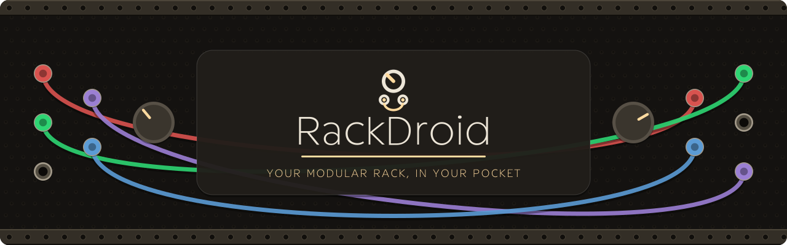
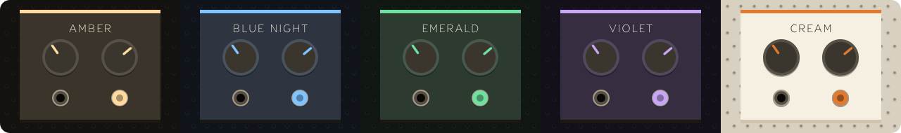

<div align="center">



<p>    </p>

<p><b>English</b> · <a href="README.it.md">Italiano</a> · 🌐 <a href="https://rackdroid.org">rackdroid.org</a> · unofficial, not affiliated with VCV</p>

A **touch-first** modular synthesizer for Android — build real patches by
dragging cables between oscillators, filters, envelopes and sequencers, just
like a hardware rack. No compromises: it's the [VCV Rack 2](https://vcvrack.com)
audio engine, made native for your phone.


*Real screenshots, from real devices — no mockups.*

</div>


- **It's VCV Rack, not a clone.** Same DSP, same 66 built-in modules, same
  `.vcv` patch format, built from the upstream v2.6.4 sources. What is
  adapted for phones is how the engine's threads take turns — under a hundred
  lines of Rack changed, at build time, the sources left as they are — and it
  does not touch the sound: every module that can be compared gives the same
  samples, bit for bit, as Rack's own loop. Measured against VCV Rack on
  desktop too: what remains is the last digit, which a different processor
  rounds differently.
- **Touch-first from day one**, not a shrunk-down desktop UI: drag cables with
  a finger, long-press a knob to type a value, pinch to zoom, a module palette
  designed for small screens, and a **cable-parking bar** that solves the "two
  modules never fit on screen at once" problem.
- **Low native latency** (Oboe/AAudio, full-duplex) — it plays in real time,
  not a toy. How low is partly the phone's decision, not the app's: some
  manufacturers reserve the fast audio path for apps on a list of their own,
  and refuse it to everything else (a OnePlus 8T refuses it even to commercial
  synths). The engine measures what it actually got and tunes itself to it —
  see [Performance](#performance).
- **Grows with you**: start with the 66 built-in modules, then add whole
  packages (Bogaudio, Valley, Befaco, HetrickCV…) on the fly, without updating
  the app.
- **Runs on older hardware too**: supported from Android 10 up.


| | |
|---|---|
| 🎚️ **Native audio engine** | Oboe/AAudio, full-duplex, low latency where the device grants it — the engine measures what it got and tunes its own thread count to suit ([Performance](#performance)) |
| 🧩 **66 built-in modules** | Core (Audio/MIDI), Fundamental (39 modules: VCO, VCF, VCA, ADSR, LFO, SEQ-3, Delay, Mixer, Scope, Quantizer…), RackDroid Drums (14 original 808-style drum voices) |
| 👆 **Touch interface** | one finger pans the rack, drag for cables/modules, pinch to zoom, long-press a knob to type a value |
| 🪟 **Glass toolbar** | File/Edit/View/Engine/Help menus plus sixteen tools on two rows: palette, module manager, cable parking, theme, MIDI, keyboard, recording, info; undo/redo, multi-select, copy/paste, delete, the two padlocks — collapses into a tab |
| ✅ **Select and edit** | turn on multi-select and a tap picks a module out (tap again to drop it); a hold moves the whole selection. Selected modules get a red halo instead of a wash over the panel, so the artwork stays readable. Delete asks first and says how many are going |
| 🧲 **Module palette** | chips by category (VCO, LFO, VCF, VCA, ENV, SEQ, DRUM, MIX, FX, NOISE, QNT, MIDI, UTIL), draggable previews, ⓘ badge with name/description/tags |
| 🧵 **Cable parking** | a left-edge bar where a cable end waits while you scroll to its destination — grows from 3 up to 10 holes as you fill them, lights up compatible ports while you aim, collapses to a handle |
| 🎹 **MIDI** | on-screen musical keyboard, USB and Bluetooth LE MIDI |
| ⏺️ **Recording** | output to a WAV file in `Documents/RackDroid/` |
| 🎓 **Guided learning** | a 20-step interface tour on first run that demonstrates itself — a step per menu that says what is inside and then opens it, plus framing your modules, opening the palette, moving a module, zooming and scrolling the rack, and drawing a cable with the compatible jacks lit, then putting everything back — 30 step-by-step tutorials across 5 levels, plus a topic-based guide |
| 🔄 **Updates (GitHub build)** | opt-in: RackDroid can ask GitHub once a day whether a newer release exists and install it. Refuse and it never connects — the Play build has no updater and no network permission at all |




Amber, Blue Night, Emerald, Violet and the light one, Cream — from the palette button in the toolbar. A theme recolours the toolbar, the menus, the rack and the built-in modules; module packs keep their own panels.


Beyond the built-in modules, you can add packages (Bogaudio, Valley, Audible,
Impromptu, Befaco, HetrickCV…) **on the fly**, without updating the app:

- **From the app**: *Module Manager* tool → *Install from file* → pick one or
  more `.rdmod` files. They load immediately; uninstall them from the same
  manager.
- **From a folder**: copy the `.rdmod` files to
  `Android/data/org.rackdroid/files/Modules/` and restart.
- **All of them at once**: give either route the `all_rdmods.zip` from the
  releases page as it is. A zip holding packs is unpacked and each one
  installed, so there is nothing to extract and nothing to multi-select.

Package format, the native loading mechanism, and instructions for
**creating** a plugin: see **[MODULES.md](MODULES.md)** and the manual at
**[docs/rackdroid-manuale.pdf](docs/rackdroid-manuale.pdf)**.


**Android 10 (API 29)** or later on a 64-bit `arm64-v8a` or `x86_64`
device. Requires OpenGL ES 3.0. `arm64-v8a` is the normal phone/tablet build;
`x86_64` is intended mainly for emulators and compatible ChromeOS devices.

<a name="performance"></a>


**The engine tunes itself. There is no thread setting to get wrong**, which is
why the Threads menu is not there on Android: the right number turned out to be
8 on one phone and 2 on another, and 3 on the same phone once it was warm.

It depends on which audio path the device grants. Where the fast (exclusive)
path is available, the engine spreads work across every core it can use. Where
it is refused — some manufacturers reserve that path for an approved list of
apps — extra cores stop helping and start hurting, because the engine
synchronises its worker threads twice per sample and that cost grows with the
thread count rather than with the patch. On such a device, two threads can run
a 76-module patch cleanly where seven crackle constantly, at a third of the CPU
and far less heat. So the engine measures underruns and settles wherever they
stop.

It also comes back down. Anything transient — a heavy moment, another app, a
warm spell — pushes the count up, and if nothing ever brought it back the
engine would spend the rest of the session on cores it no longer needs. So
once a count has held clean for a minute, it spends one window asking whether
a smaller one would do, and keeps the answer. It remembers where it settled,
too, so the next launch starts there instead of walking the whole ladder
again.

None of this counts a measurement it should not trust: a window containing a
touch, a rotation, a trip to the home screen or a reopened audio stream is
thrown away rather than blamed on the patch.

If the audio breaks up:

- **Check the log** — the ⓘ tool in the toolbar, then **Log** — for lines
  starting `Engine:`. They say which path the device granted and where the
  engine settled.
- **Heat matters more than you would think.** A hot phone throttles, and the
  best thread count moves; the engine follows it, but a phone that has been
  rendering at full tilt for an hour has less to give.
- **A patch can simply be too heavy.** The engine says so rather than leaving
  you guessing.

Zoom stops at 2×. Past that, every visible module is redrawn into a far larger
buffer on each zoom step, and on a phone that competes with the audio callback
for the same cores — it was breaking the sound up at maximum zoom.


Gradle project at the repo root (`minSdk 29`). All `third_party/`
sources (Rack v2.6.4, Oboe, all plugins) are **vendored in the repo**: a clean
clone compiles as-is, no submodule init needed.

```sh
export JAVA_HOME=~/jdk21; export ANDROID_HOME=~/android-sdk
./gradlew assembleSideloadRelease -PdevKeystore                 # arm64-v8a (default)
./gradlew assembleSideloadRelease -PdevKeystore -PtargetAbis=x86_64  # x86_64
./gradlew bundlePlayRelease -PtargetAbis=arm64-v8a,x86_64       # Play AAB, both 64-bit ABIs
```

- `-PdevKeystore` signs with the public development key (update continuity for
  sideloading; use a private key for Play).
- The base APK is ~40 MB and contains only the built-in modules. Optional
  libraries are built with `-PallPlugins`, excluded from the APK, and
  distributed as ABI-specific `.rdmod` files (`packaging.jniLibs.excludes`,
  see `scripts/make_rdmods.sh`).


```
app/            Android module (Gradle, manifest, MainActivity + Kotlin UI)
native/
  CMakeLists.txt  Rack engine + dependencies + port layer build
  port/           porting code (Oboe audio, menus, browser, plugin loader…)
  host/           engine/UI smoke tests on Linux
drums/          RackDroid Drums (first-party package, original code + panels)
graphics/       original graphics (panels, thumbnails, rebuilt ComponentLibrary, screenshots)
third_party/    Rack, Oboe and plugin sources (upstream untouched)
scripts/        setup.sh (sources) · make_rdmods.sh (packages the .rdmod files)
docs/           user manual (PDF + HTML source)
MODULES.md      .rdmod format, loading mechanism and plugin creation
```

Guiding principle: **zero patches to Rack's sources**. All platform-specific
code lives in `native/port/`; desktop-only files are excluded from the build
and replaced, so upgrading to new upstream versions remains a simple submodule
bump.


- Rack's code is **GPLv3**: this port is GPLv3 and the complete sources are in
  the repository (license obligation satisfied ✓).
- **Trademark**: the app presents itself as "RackDroid" (custom icon,
  rebranded strings); the "VCV" name/logo is not used ✓.
- **Graphics**: the original ComponentLibrary and Core panels are **CC
  BY-NC-ND 4.0** (non-commercial). RackDroid uses **rebuilt** graphics
  (`graphics/`, GPLv3) in their place to be distributable; the
  Fundamental/Bogaudio etc. plugins are GPLv3 with their graphics included ✓.
- **Signing**: `keystore/rackdroid.keystore` is a **development** key with a
  public password (`rackdroid`) — for update continuity when sideloading, NOT
  for authenticity. For a store, generate a private key (or use Play App
  Signing).
- **Google Play**: distributing native code executed from **outside** Play
  violates their policies; the `.rdmod` folder / file installation are for
  sideload/GitHub builds. For Play, deliver extra packages via *asset packs*.


<div align="center">

RackDroid is a port of VCV Rack (GPLv3). Not affiliated with or endorsed by VCV.

</div>
